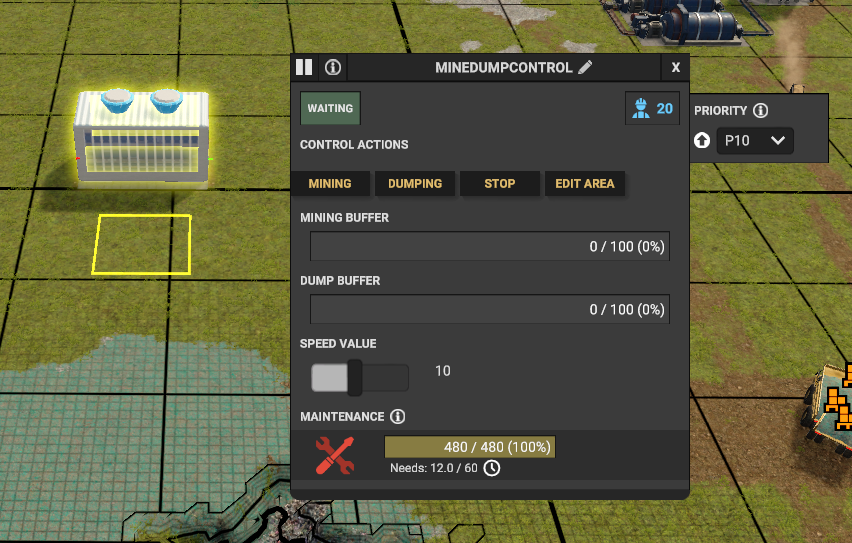

## This is a Captain Of Industry Mod that includes a Mining/Dumping Building into the game.

The working is similar to the MineTower, but without the use of Trucks & Excavators.

It uses the standard Mine/Dump designations of the game, and like the MineTower an active area for where to work.

Mined/ToBeDumped resources need to transfered using belts, no possibility to use trucks.

The building is can be in Pause, Mining or Dumping state. Simultaneous mining & dumping is not possible.

The results of the mine/dump is not as clean as using trucks/excavators, for a complete flat area, a MineTower action needs to be used afterwards.
Don't know yet whether this is a good choice, but implemented this way to make it not to powerfull.

For now, there is a speedcontrol slider in the UI. 1 -> fastest, 10 -> slowest.

When the research is unlocked, the new building is available in the "Buildings" toolbar.

# Installation
Extract the included folder in the .ZIP to '%appdata%/Captain of Industry/Mods'. When creating a new game, you will be prompted to select which mods to use.

This Mod can be used in new and existing games.

Due to the limited Mod options (yet) in the game, once the mod is used in a game (save), it is not possible to remove it again.

# Usage

1 /2 Make mine/dump designations the standard way. 
1/2 Place a MineDumping Building, and set the area around it.
3/ Connect in/out transport belts on wht you need.
4/ Switch on the mining or dumping in the UI.
5/ The mining/dumping starts using the designations the area, taking or loading the goods on the belts
